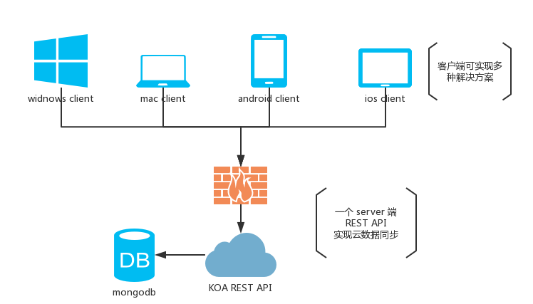

# Treering

一个简单的时间管理器。

### 为什么要做这个

从2013年末开始发现合理安排时间的重要性。先后使用过各种印象笔记，有道云笔记，为知笔记，开始觉得很是好用。后来发现这些笔记类型的应用并不切合我真正的痛点，我的痛点不是记笔记而是讲每件要做的事情安排成线性已达到关注点唯一的目的。这是我时常遇到的问题，每天就1~2件事情做的时候思路很清晰，但是当有3件以上的事情要做时头脑就会分散在不同的事情上，导致实际上的工作效率低下。我自己说我自己的话就是——越忙你就越忙，直至陷入恶性循环。

后我开始接触时间管理，了解时间四象限法则，番茄工作法，GTD概念，觉得对我的时间管理提高很有用。但市面上的很多时间管理的工具都不尽人意（免费的都跟屎一样，付费的贼贵）。所以我用简化的四象限法则创建了这个应用。

### 特点

* 前后端分离架构，后端使用koa完成SOA化API, 实现云处理
* 实现跨平台容易，接口唯一切对外开放，可以作为第三方调用，那表现层的实现可随意。预计这个项目会用到多端技术方案electron，cordova, react native, webapp
* 备忘编辑支持markdown语法
* 拖拽实现任务排序
* 简单实用 

### 简单架构

### 多终端实现

* [treering-windows](https://github.com/shangxinbo/treering-windows)

### 文档

你可以直接查看，也可以查看[resource.apib](./resource.apib)

### 技术栈

* api blueprint  with aglio
* koa
* mongoose + mongodb